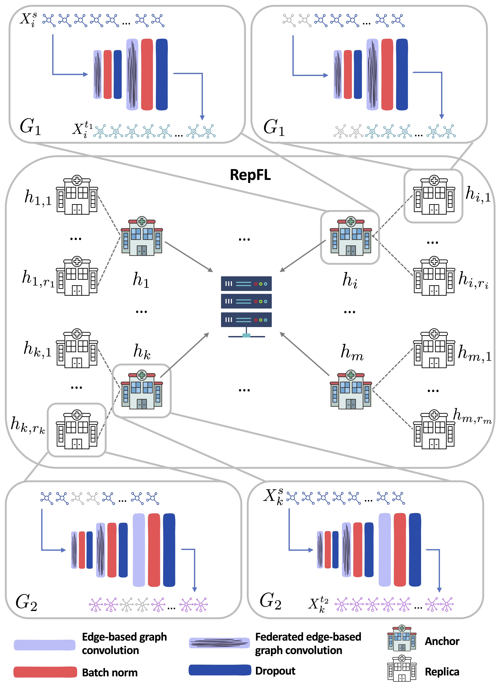

# RepFL

This repository provides the implementation for ["Replica-Based Federated Learning with Heterogeneous Architectures for Graph Super-Resolution"](https://link.springer.com/chapter/10.1007/978-3-031-45676-3_28) paper, which has been accepted at the International Workshop on Machine Learning in Medical Imaging (MLMI), held in conjuction with MICCAI 2023.



> **Replica-Based Federated Learning with Heterogeneous Architectures for Graph Super-Resolution**
>
> [Ramona Ghilea](https://github.com/ramonaghilea)<sup>1</sup>, [Islem Rekik](https://basira-lab.com/)<sup>1</sup>
>
> <sup>1</sup>BASIRA Lab, Imperial-X and Department of Computing, Imperial College London, London, UK

> **Abstract:**  Having access to brain connectomes at various resolutions is impor-
tant for clinicians, as they can reveal vital information about brain anatomy and
function. However, the process of deriving the graphs from magnetic resonance
imaging (MRI) is computationally expensive and error-prone. Furthermore, an
existing challenge in the medical domain is the small amount of data that is avail-
able, as well as privacy concerns. In this work, we propose a new federated learn-
ing framework, named RepFL. At its core, RepFL is a replica-based federated
learning approach for heterogeneous models, which creates replicas of each par-
ticipating client by copying its model architecture and perturbing its local training
dataset. This solution enables learning from limited data with a small number of
participating clients by aggregating multiple local models and diversifying the
data distributions of the clients. Specifically, we apply the framework for graph
super-resolution using heterogeneous model architectures. In addition, to the best
of our knowledge, this is the first federated multi-resolution graph generation
approach. Our experiments prove that the method outperforms other federated
learning methods on the task of brain graph super-resolution. Our RepFL code is
available at https://github.com/basiralab/RepFL.


## Implementation Details
The code for the project was implemented using Python 3.8.16 and PyTorch 2.0.0 on macOS (Apple M1) and Python 3.10.12 and PyTorch 2.0.1 on Linux (Nvidia Tesla A30, Nvidia Tesla T4 and Nvidia GeForce GTX Titan Xp).


## Installation Details

### macOS

1. Create a new Anaconda environment and activate it

```
conda create --name pyg python=3.8
conda activate pyg
```

2. Install aem64 compilers (needed for using torch-geometric on M1 GPU)

```
conda install -y clang_osx-arm64 clangxx_osx-arm64 gfortran_osx-arm64
```

3. Install the dependencies (PyTorch) <br>
Make sure to replace MACOSX_DEPLOYMENT_TARGET=13.0 with the OS version that you have, and the torch version you need.

```
MACOSX_DEPLOYMENT_TARGET=13.0 CC=clang CXX=clang++ python -m pip --no-cache-dir install torch==1.12.1 torchvision==0.13.1 torchaudio==0.12.1
```

You can check the PyTorch version by running the following command:

```
python -c "import torch; print(torch.__version__)"
```

It will display something like this:

```
2.0.0
```

3. Install the dependencies (PyTorch Geometric)

```
MACOSX_DEPLOYMENT_TARGET=13.0 CC=clang CXX=clang++ python -m pip --no-cache-dir  install  torch-scatter -f https://data.pyg.org/whl/torch-1.12.1+${cpu}.html
MACOSX_DEPLOYMENT_TARGET=13.0 CC=clang CXX=clang++ python -m pip --no-cache-dir  install  torch-sparse -f https://data.pyg.org/whl/torch-1.12.1+${cpu}.html
MACOSX_DEPLOYMENT_TARGET=13.0 CC=clang CXX=clang++ python -m pip --no-cache-dir  install  torch-cluster -f https://data.pyg.org/whl/torch-1.12.1+${cpu}.html
MACOSX_DEPLOYMENT_TARGET=13.0 CC=clang CXX=clang++ python -m pip --no-cache-dir  install torch-geometric
```

4. Install other dependencies

```
conda install -c conda-forge matplotlib
conda install -c anaconda networkx
conda install -c anaconda seaborn
```

5. Resources: [Installing PyTorch Geometric on Mac M1 with Accelerated GPU Support](https://medium.com/@jgbrasier/installing-pytorch-geometric-on-mac-m1-with-accelerated-gpu-support-2e7118535c50)

### Linux

1. Create a new Python environment and activate it

```
python3 -m venv pyg
source pyg/bin/activate
```

2. Install the dependencies (PyTorch) <br>
Make sure to have the appropriate CUDA version in the link. The available versions can be found at https://data.pyg.org/whl/.

```
pip3 install torch torchvision torchaudio --extra-index-url https://download.pytorch.org/whl/cu117
```

You can check if the PyTorch and CUDA versions match by running the following command:

```
python -c "import torch; print(torch.__version__)"
```

It will display something like this:

```
2.0.1+cu117
```

3. Install the dependencies (PyTorch Geometric)

```
pip install torch-sparse==0.6.17 -f https://pytorch-geometric.com/whl/torch- 2.0.1+cu117.html
pip install torch-scatter==2.1.1 -f https://pytorch-geometric.com/whl/torch- 2.0.1+cu117.html
pip install torch-cluster==1.6.1 -f https://pytorch-geometric.com/whl/torch- 2.0.1+cu117.html
pip install torch-geometric
```

4. Install other dependencies

```
pip install networkx
pip install matplotlib
pip install seaborn
```


## Executing RepFL

### Dataset
We provide simulated data of 279 samples, each having three graphs: one graph with resolution 35, one graph with resulution 160, and one graph with resolution 268. If you want to use your own dataset, please modify the method ```utils/utils/read_and_preprocess_files``` such that it returns the desired data.

### Train

```
python train/train_slim.py --alg {algorithm} --seed {seed} --le {local_epochs} --r {rounds} --batch {batch_size} --folds {folds} --global_run_name {global_run_name} --run_name {run_name} --perturbed {no_perturbed_samples} --replicas {no_replicas}
```

**Parameters**

| Parameter | Values | Definition |
| ------ | ------ | ------ |
| algorithm | baseline, fedavg, feddyn, feddc, repfl | The federated learning algorithm to run
| seed | int | Seed for random
| local_epochs | int | Number of local epochs
| rounds | int | Number of rounds
| batch_size | int | Batch size
| folds | int | Number of folds for K-fold cross validation
| global_run_name | string | Name of directory where the plots will be saved
| run_name | string | Name of directory where the models will be saved
| no_perturbed_samples | int | Percentage of perturbed samples in replicas datasets
| no_replicas | int | Number of replicas for each client (anchor)


**Examples**

```
python train/train_slim.py --alg fedavg --le 10 --r 10 --batch 5 --folds 5 --global_run_name global_fedavg --run_name fedavg
```

```
python train/train_slim.py --alg repfl --le 10 --r 10 --batch 5 --folds 5 --global_run_name global_repfl --run_name repfl --perturbed 30 --replicas 3
```

### Test

```
python test/test_slim.py --alg {algorithm} --global_run_name {global_run_name} --run_name {run_name}
```

**Parameters**

| Parameter | Values | Definition |
| ------ | ------ | ------ |
| algorithm | baseline, fedavg, feddyn, feddc, repfl | The federated learning algorithm to run
| global_run_name | string | Name of directory where the plots will be saved
| run_name | string | Name of directory where the models were saved and where test results will be saved


**Examples**

```
python test/test_slim.py --alg fedavg --global_run_name global_fedavg --run_name fedavg
```

```
python test/test_slim.py --alg repfl --global_run_name global_repfl --run_name repfl
```


## Please cite the following paper when using our work:

```latex
@inproceedings{ghilea2023replica,
  title={Replica-Based Federated Learning with Heterogeneous Architectures for Graph Super-Resolution},
  author={Ghilea, Ramona and Rekik, Islem},
  booktitle={International Workshop on Machine Learning in Medical Imaging},
  pages={273--282},
  year={2023},
  organization={Springer}
}
```

## Contact

For questions regarding the code, please contact ramonaghilea9@gmail.com.